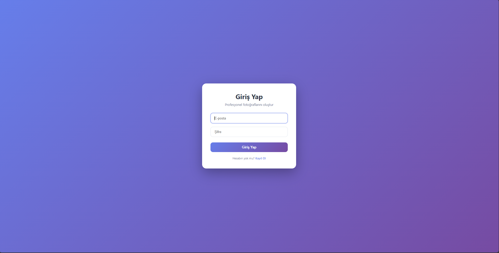
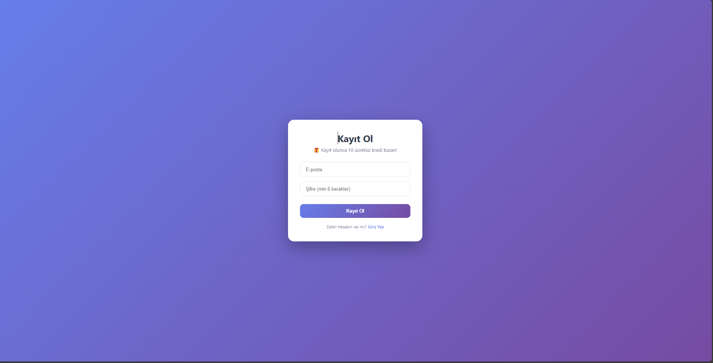

# ✨ AI Professional Photo Studio

Yapay zeka ile sıradan fotoğraflarınızı profesyonel iş fotoğraflarına dönüştürün!


## 🎯 Özellikler

- 🤖 **Flux AI** ile profesyonel fotoğraf oluşturma
- 👤 Kullanıcı girişi ve kredi sistemi (10 ücretsiz kredi)
- 🎨 Cinsiyet ve arka plan özelleştirme (Nötr, Ofis, Dış Mekan, Stüdyo)
- ⚡ 10-30 saniyede sonuç
- 📱 Mobil uyumlu modern arayüz

## 📸 Ekran Görüntüleri

<table>
  <tr>
    <td><br/><b>Giriş Ekranı</b></td>
    <td><br/><b>Kayıt Ekranı</b></td>
  </tr>
  <tr>
    <td colspan="2"><br/><b>Ana Uygulama - Fotoğraf Oluşturma</b></td>
  </tr>
</table>

## 🚀 Kurulum

### 1. Replicate API Key Al

1. [replicate.com](https://replicate.com/) → Kaydol
2. Settings → API Tokens → Token oluştur
3. Token'ı kopyala (`r8_...` ile başlar)

### 2. Backend Kurulumu

```bash
cd backend

# Virtual environment
python -m venv venv
venv\Scripts\activate  # Windows
source venv/bin/activate  # Mac/Linux

# Paketleri yükle
pip install -r requirements.txt

# .env dosyası oluştur
copy .env.example .env  # Windows
cp .env.example .env    # Mac/Linux
```

**`.env` dosyasını düzenle:**
```env
REPLICATE_API_TOKEN=r8_buraya_senin_token_in
JWT_SECRET_KEY=güçlü_bir_şifre_123456
```

**Veritabanını oluştur:**
```bash
python
>>> from server import app, db
>>> with app.app_context(): db.create_all()
>>> exit()
```

**Başlat:**
```bash
python server.py
```

### 3. Frontend Kurulumu

**Yeni terminal aç:**
```bash
# Paketleri yükle
npm install

# Başlat
npm run dev
```

### 4. Tarayıcıda Aç

```
http://localhost:3000
```

## 🎨 Arka Plan Seçenekleri

- ⚪ **Nötr** - Pasaport, resmi belgeler
- 🏢 **Ofis** - LinkedIn, CV
- 🌳 **Dış Mekan** - Sosyal medya
- 📷 **Stüdyo** - Portfolio

## 🛠️ Teknolojiler

**Backend:** Flask, SQLAlchemy, JWT, Replicate API  
**Frontend:** React, Vite, Axios  
**AI Model:** Flux-Kontext Professional Headshot

## 🐛 Sorun mu Var?

**Backend çalışmıyor:**
```bash
# Virtual environment aktif mi kontrol et
deactivate
venv\Scripts\activate
python server.py
```

**Frontend çalışmıyor:**
```bash
# Temizle ve yeniden yükle
rm -rf node_modules package-lock.json
npm install
npm run dev
```

**API Token hatası:**
```bash
# .env dosyası backend/ klasöründe mi?
cat backend/.env  # Mac/Linux
type backend\.env  # Windows
```

## 📦 Deploy (Render.com)

### Backend:
1. render.com → "Web Service"
2. Root: `backend`
3. Build: `pip install -r requirements.txt`
4. Start: `gunicorn server:app`
5. Env vars: `REPLICATE_API_TOKEN`, `JWT_SECRET_KEY`

### Frontend:
1. render.com → "Static Site"
2. Build: `npm install && npm run build`
3. Publish: `dist`

## 💰 Maliyet

- Replicate: ~$0.005 per image
- Render: Ücretsiz tier (750 saat/ay)

## 🤝 Katkıda Bulun

```bash
git checkout -b feature/yeni-ozellik
git commit -m 'Yeni özellik eklendi'
git push origin feature/yeni-ozellik
```

## 📄 Lisans

MIT License

## ⭐ Destek

Beğendiysen star vermeyi unutma!

---

**Made with ❤️**
